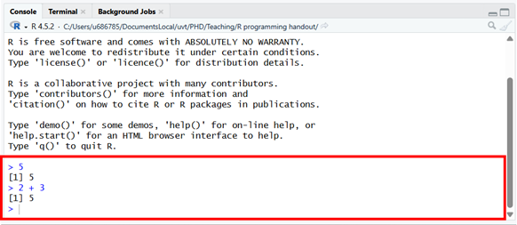
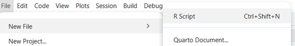
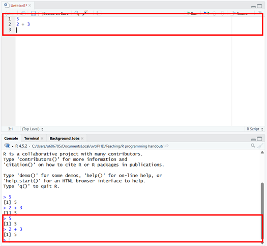
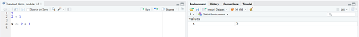
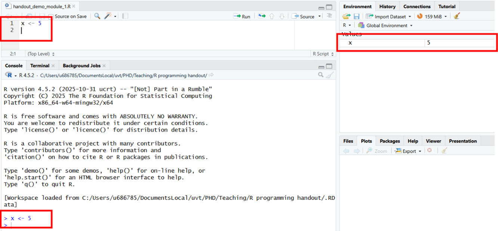
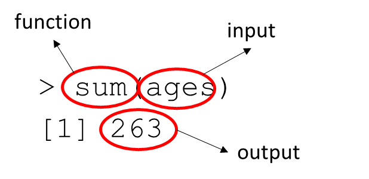
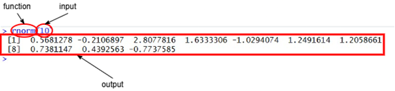
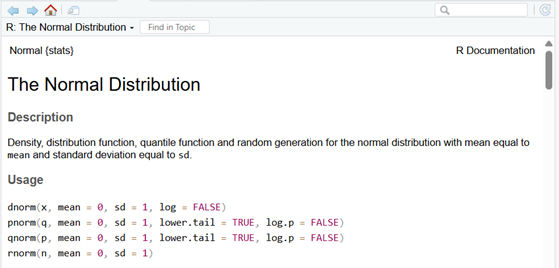
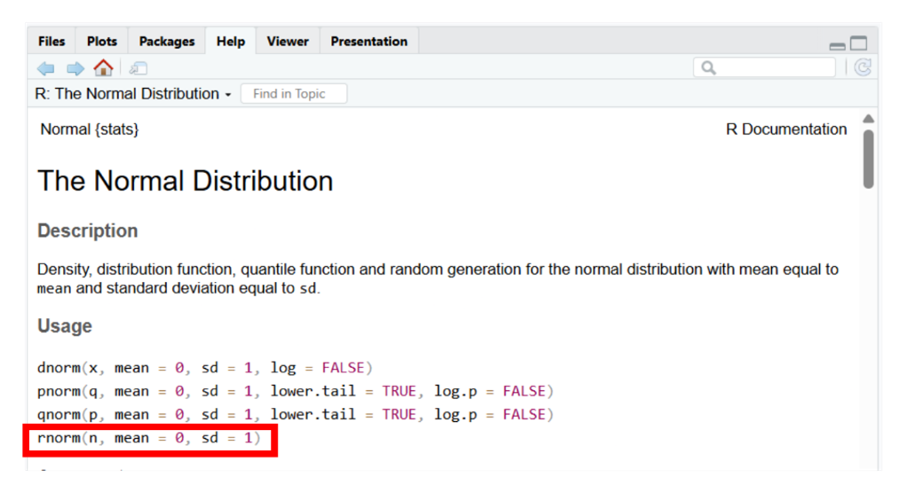
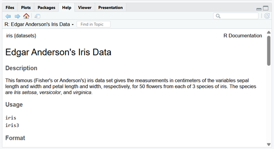

# The Basics {#basics}

Download link for Exercise 1: [exercise 1](./exercises/exercise1.docx)

Download link for Answers to Exercise 1: [solutions exercise 1](./exercises/exercise1_solutions.R)

## Navigating RStudio

RStudio is laid out into 4 different panes. The default panes are as shown below:

```{r echo = FALSE}
knitr::include_graphics("images/RStudioLayout.png")
```

### Console Window

- This window is where your code will be run by R, and also where the result of the code will be printed.

- You can try it out by typing `5` into the R console after the “\>” prompt, and then hitting enter. Then type `2 + 3`. What do you see?

In both cases R returns the `5` as a response from the input.

```{r echo = FALSE}

```

### Editor Window {#editor-window}

- This window is where you can create R scripts wherein you can write down your code to store so you can rerun it multiple times and store it for later reuse.

- To open an R script, navigate to the following:

```{r echo = FALSE}

```

- In your newly opened R script, type in `5` on line 1, then click enter to create a new line and type `2 + 3`. To run these lines of codes, select them or hold your cursor on that line and either press CTRL+ENTER, or click on the Run button. What do you see?

```{r echo = FALSE}

```

The commands are run through the console, and the output is presented the same way as before.

- To store this file either press CTRL+S, or navigate to File \> Save, and give the script a name. You can reopen this file and your previously written code will be available for you to rerun.

### Workspace Window

- This window contains your Environment which shows all the Objects (more on these later) you currently have stored in your R workspace. This window shows you what information you currently have stored.

- In your [Editor Window](#editor-window) type `x <- 2 + 3` and run it. What do you see in your Workspace window?

You can see that the Object `x` is now stored in your workspace and has the value of `5` assigned to it.

```{r echo = FALSE}

```

- Now type x into your [Editor Window](#editor-window)and run it, what output do you see in the console window?

The console returns `5`, the value of `x`.

### "Other" Window

This window contains several different panes each with their own function, we will encounter some of these panes as we go through these modules and some others you will likely never use for the rest of your life.


**START EXERSISE 1.1**

## Data as Objects

In R, we spend most of our time working with objects. Objects can be almost anything, from numbers like the `5` you worked with earlier, to whole datasets, graphic figures, and even code itself can be stored and passed around as an object. To create your own object you make use of `<-` as you did previously:

```{r echo = FALSE}

```

[As a quick note]{.underline}: we advise you to code along with these examples so you understand how to implement them in RStudio.

One major type of object you will frequently encounter (and in fact you just created one) is Data. Data is a broad category comprising anything from a single number to a multi-dimensional array, but for now let’s focus on vectors.

### Vectors

A vector is *one or more of the same type of things, one after the other*

The function `c()` can create vectors:

```{r}
c(1, 2, 3)
```

```{r}
c("Hagrid", "Harry")
```

Notice I make vectors of numbers or sentences but not both at the same time - hence "the same [type]{.underline} of thing". Below are examples of different "single" objects that can occur together in a vector.

```{r data-types, tidy = FALSE, echo = FALSE}
df <- data.frame(Example = c("42", "2.1543", "\"Felix\"; \"Tilburg\"", "TRUE; FALSE"),
                 Type = c("Integer (numeric)", "Double (numeric)", "Character", "Logical"),
                 Explanation = c("A number contains no decimals", "A number that **may** contain decimals", "A string of textual characters", "Special characters indicating either TRUE or FALSE"))

knitr::kable(df, caption = "Fundamental R Data Types",  booktabs = TRUE)

```

Note that you cannot create a vector from different types of objects. Thus in the following case:

```{r}
c("Hagrid", 1)
```

R automatically turns the `1` numeric type variable into a `"1"` character type variable to turn the vector into a character vector.

You may hear some people call R a “vectorized language”. What they are referring to is that when you perform an operation on a vector in R it will often perform that operation on each element of the vector.

For example, suppose there are 14 students in a class, of the following ages:

```{r}
c(22, 22, 21, 25, 23, 19, 23, 25, 19, 21, 20, 23)
```

Then I can get their squared ages by:

```{r}
c(22, 22, 21, 25, 23, 19, 23, 25, 19, 21, 20, 23)^2
```

Or the sum of the ages as:

```{r}
sum(c(22, 22, 21, 25, 23, 19, 23, 25, 19, 21, 20, 23))
```

Typing out a vector each time you want to do something with it is way too much work and looks messy. Just like any other object in R, you can store a vector of values for later use by assigning it to a [variable]{.underline}. This works the same way as assigning a single value:

```{r}
ages <- c(22, 22, 21, 25, 23, 19, 23, 25, 19, 21, 20, 23)
ages
```

### Variables

A variable is a placeholder name that refers to some object, such as a vector. They function like the numbers they have on clothing racks in some places:

- The coat is the value and the number on the hanger is the name of the variable

- So, `c(22, 22, 21, 25, 23, 19, 23, 25, 19, 21, 20, 23)` is the coat, and `ages` is the “hanger”.

Putting the coat on a hanger is called "assigning" a value to a variable.  As mentioned before assigning value into variables is done with `<-`.

A variable can be named anything as long as it does [not]{.underline} start with a number, does not contain operators, contains at least one regular letter character, and is preferably not already in use by R.

```{r object-errors, tidy = FALSE, echo = FALSE}
df <- data.frame(Acceptable = c("my_var_3", "x_ (fine albeit ugly)", "hamburgers_with_cheese (you can go as crazy as you want with your names)", "x"),
                 "Not Acceptable" = c("3_my_var (starts with a number)", "x^ (contains an operator character)", "__ (no letter character)", "pi (already in use by R; meaning that if you use it, it will overwrite the pi constant in R, and to use the pi constant again you would need to reset your R workspace)"))

knitr::kable(df, caption = 'Object Naming Rules', booktabs = TRUE)
```

```{r}
pi

pi <- 5

pi
```

To reset a workspace -for example in case of the assign to pi issue described above – you can make use of the following line of code:

```{r}
rm(list = ls())
```

- With ls() you can see your objects

- With rm() you can remove them

Once you have assigned a value to your variable, you can now reuse that variable to perform all sorts of calculations.

```{r}
ages <- c(22, 22, 21, 25, 23, 19, 23, 25, 19, 21, 20, 23)

ages^2

sum(ages)

220 - ages

predicted_maximum_heart_rate <- 220 - ages

predicted_maximum_heart_rate
```

[Note:]{.underline} variable names are case sensitive!

`ages` is not the same as `Ages` or `AGES` or `ageS`!

If you misspell the variable name, R will respond with an error explaining what went wrong:

```{r error = TRUE}
ages <- c(22, 22, 21, 25, 23, 19, 23, 25, 19, 21, 20, 23)

Ages

AGES

ageS

ages
```


**START EXERSISE 1.2**


## Functions

Besides Variables, another common object in R are [Functions]{.underline}. Functions in R take the following form:

`f()`

You have already used several functions `c(1, 2, 3)`; `sum(ages)`; `rm()`; `ls()`.

Another example of a function you have used already are operators such as `+` and `^`. You have used these operators as `3 + 2`. This is shorthand for `'+'(3, 2)`.

Almost always in R, functions also take some form of input, and have the following property:

```{r echo = FALSE}

```

An example of this principle is the following:

```{r echo = FALSE}
sum(ages)
```

```{r echo = FALSE}

```

`sum` is a function that [takes]{.underline} a vector (input) and [returns]{.underline} the sum of that vector (output).

Another example is the following:

```{r}
rnorm(10)
```

```{r echo = FALSE}

```

`rnorm` is a function that [takes]{.underline} an integer (input) and [returns]{.underline} that number of random observations from a standard normal distribution (output).

The input of a function is called its [arguments]{.underline}. Looking at our previous examples:

- `ages` is the argument in `sum(ages)`

- `10` is the argument in `rnorm(10)`

Functions can have multiple arguments:

```{r}
rnorm(10, mean  = 4, sd = 2)
```

Arguments can be specified either by name, or position:

- `rnorm(10, mean = 4, sd = 2)` does the same as `rnorm(10, 4, 2).`

While specifying by position is faster to write and can sometimes remain easy to read (note how we did not name the first argument in the `rnorm()` function above, for example), for clarity it is often smart to specify all arguments but the first by name.

You can figure out which arguments you can specify and under which names by consulting the help files by adding `?` in front of the function name:

```{r}
?rnorm
```

```{r echo = FALSE}

```

This opens the help files, which shows a description of the function, a description of its arguments, as well as [default]{.underline} values for those arguments. Default values represent the values that the function will use for arguments when they are not specified.

```{r echo = FALSE}

```

We can see that for `rnorm`, the mean and standard deviation of the normal distribution from which `n` observations are drawn is `0` and `1` respectively. This means that if we don’t specify `mean` and `sd`, and run `rnorm(10)`, we will draw 10 observations from a normal distribution with a mean of 0 and a standard deviation of 1.

We can also see that `n` does not have a default argument, which means that when we do not specify it, R gives us the following error:

```{r error = TRUE}
rnorm(mean = 4, sd = 2)
```

Some arguments [have to]{.underline} be specified for a function to run. How do you know which arguments need to be specified? Look at the help files (or online).

Another common reason for errors is the result of inserting the wrong data type (integer, float, character, logical, etc.) into an argument. The `sum()` function in the following example requires a numeric vector as input, but we gave it the character vector `sum(c("Happy Meal", "Roger Rabbit")`) instead:

```{r error = TRUE}
sum(c("Happy Meal", "Roger Rabbit"))
```

The error message shows that an invalid type of argument was used. Logically this makes sense too, you cannot calculate a numeric sum from `"Happy Meal"` & `"Roger Rabbit"`. Again, look at the help files (or online) to learn what type of arguments are valid input.

Some more example functions:

```{r}
ages <- c(22, 22, 21, 25, 23, 19, 23, 25, 19, 21, 20, 23)
length(ages)
```

`length()` prints out the number of elements within a vector.

```{r}
ages <- c(22, 22, 21, 25, 23, 19, 23, 25, 19, 21, 20, 23)
table(ages)
```

`table()` provides a descriptive overview of each unique value in a vector with a count showing how often the value occurred in the vector.

### Finding Help

When using R, half your time will be spent searching help.

#### Help Files in R

We already showed you how you can use the `?` operator to open the help files for a function. It also works for built-in datasets in R:

```{r echo = FALSE}

```

You can also get help using the following functions:

- `help("sum")` or `help(sum)`

- `apropos("sum ")` or `apropos(sum)` \<- finds all functions with “sum” in the name.

- `help.start()` to open the manual browser

#### Internet

You can make use of information available on the internet with the following resources:

- Google (or any other search engine)

- Stackoverflow (a website where a community of programmers help\* answer each others question; \*the tone isn’t always the most helpful, but the information usually is)

- Cheat sheets, and other materials like these modules.

  - Basic: <https://cran.r-project.org/doc/contrib/Short-refcard.pdf>

  - For an overview, check <https://paulvanderlaken.com/2017/08/10/r-resources-cheatsheets-tutorials-books/>

#### Warnings & Errors

An [error]{.underline} means that your code does not run, because it is wrongly specified. For example:

```{r error = TRUE}
sum(c("Happy Meal", "Roger Rabbit"))
```

A [warning]{.underline} means that your code will run, but probably didn’t result in the behaviour you expected. For example:

```{r error = TRUE}
as.numeric(c(1, 2,  "three", 4))
```

In either case, do not ignore warning messages and errors. Even if everything is fine for now, you will likely run into issues later, unless you really know what you are doing.

To resolve an error/warning first carefully read it.

```{r error = TRUE}
sum(c("Happy Meal", "Roger Rabbit"))
```

To understand better where the origin of our error lies, we can separate our code into pieces:

```{r error = TRUE}
vec_x <- c("Happy Meal", "Roger Rabbit")
sum(vec_x)
```

The fault is in the second line. The error message tells you what is wrong. You cannot use the `sum()` function on a character vector.

If the error or warning message is too complex to decipher yourself, a good second step is to type the error or warning message into Google, and then look for solutions others have proposed (Stackoverflow is again a particularly helpful resource here).


**START EXERCISE 1.3**


### Indexing

[Indexing]{.underline} in R refers to selecting a subset of elements from an object. Returning to our `ages` example:

```{r}
ages <- c(22, 22, 21, 25, 23, 19, 23, 25, 19, 21, 20, 23)
```

What if we only wanted the 4^th^ student’s age?

In that case, you can use the following code:

```{r}
ages[4]
```

#### Indexing multiple elements

You index an element from a vector in R by placing the location of the element you want to index between square brackets ``` [``…``] ``` after the vector.

The `[…]` can also take vectors, in case you want more than one element from the vector:

```{r}
ages[c(1, 3, 4)]
```

In case you want the second through fifth elements of a vector:

```{r}
ages[c(2, 3, 4, 5)]
```

It can be easy to use the `:` operator.

```{r}
ages[2:5]
```

The `:` operator creates a vector running from the integer at the left side of the `:` , to the integer at the right side, in steps of 1:

```{r}
2:5
```

#### Negative Indexing

You can also index elements by telling R which element(s) you do [not]{.underline} want. This is done by putting the `-` sign in front of a single value or a vector of values.

```{r}
ages[-4]

ages[-c(1, 3, 5, 7, 9, 11)]
```

#### Named vectors & indexing by name

You can give names to elements in a vector:

```{r}
llama_age <- c("Arthur" = 14, "Zaphod" = 9)
llama_age
```

Now the vector `llama.age` has names. You can check this by doing:

```{r}
names(llama_age)
```

This allows you to index elements within that vector by adding their name in between the square brackets `[...]`.

```{r}
llama_age["Zaphod"]
```


**START EXERCISE 1.4**

