# Data

Download link for Exercise 2 and the relevant Data: [exercise 2](./exercises/exercise2_files.zip)

Download link for Answers to Exercise 2: [solutions exercise 2](./exercises/exercise2_solutions.R)

## Types of Data

We have so far seen the following types of [Data]{.underline}: Integer, Double, Character, and Logical. These can be organized as follows:

```{r echo = FALSE}
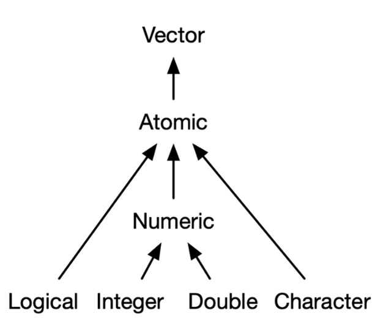
```

A special type of Integer is the [Factor]{.underline}. A factor is a vector of values. The values refer to some category, the "levels". For example:

```{r}
gender <- factor(c("Male", "Female", "Female", "Female", "Male"), 
                 levels = c("Male", "Female"))

gender
```

Just like any other type of vector, a factor can be indexed in the same way:

```{r}
gender[4]

gender[1:3]
```

You can see the possible categories of the factor by using the `levels()` function:

```{r}
levels(gender)
```

You can also *change* the categories of the factor values by using the `levels()` function:

```{r}
levels(gender) <- c("Harry", "Sally")

gender
```

Under the hood, a factor is a vector of integers. Each integer number is then associated with a name (like Harry or Sally, or Male or Female), which is displayed as the output of the factor.

We can see the underlying numerical structure by using the `as.numeric()` function:

```{r}
as.numeric(gender)
```

### Scalars, Vectors, & Matrices

#### Scalars

The most basic type of data is the [scalar]{.underline}. Scalars hold one value at a time. We can use scalars as the building blocks for more complex data types. Effectively, a scalar is a vector of length 1. Examples of scalars:

```{r oecho = FALSE}
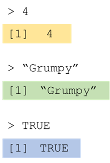
```

#### Vectors

The next type of data is the [vector]{.underline}. A vector holds multiple values at the same time, but consists of only one dimension. We have already encountered atomic vectors throughout the previous module.  When we discuss vectors throughout these modules we are referring to atomic vectors, meaning all elements in the vector are of the same data type. Examples of vectors:

```{r echo = FALSE}
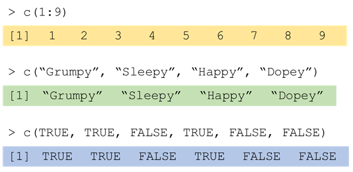
```

#### Matrices

A [matrix]{.underline} is an extension of the atomic vector. This means that every element in a matrix has to be of the same type. It functions similarly to a vector, only that each element in the matrix is organized along two dimensions. Example of a matrix:

```{r}
my_matrix <- matrix(1:9, nrow = 3, ncol = 3)

my_matrix
```

Because a matrix is organised along two dimensions, you have to index it along both dimensions.

```{r echo = FALSE}
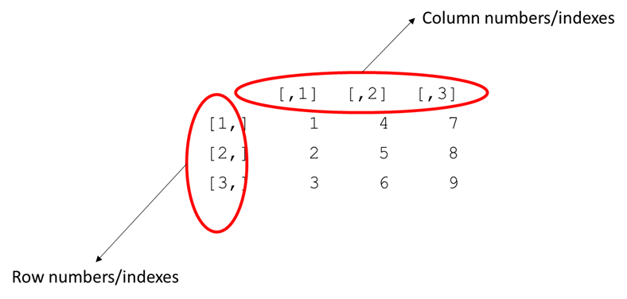
```

Indexing a matrix is done by indicating the row & column in the following way:

`my_matrix[row_nr, col_nr]`

```{r echo = FALSE}

```

```{r}
my_matrix[1, ]
```

```{r echo = FALSE}
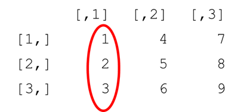
```

```{r}
my_matrix[, 1]
```

```{r echo = FALSE}
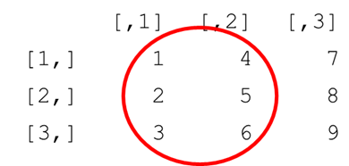
```

```{r}
my_matrix[, 1:2]
```

```{r echo = FALSE}

```

```{r}
my_matrix[1, 3]
```

```{r echo = FALSE}

```

```{r}
my_matrix[3, 1]
```

### Lists & Data frames

#### Lists

So far, we have only looked at [Atomic]{.underline} data. Atomic data requires all elements in it to be of the same type. The other category of data is [List]{.underline} data. In Lists elements can be of different types. Here is an example:

```{r}
my_list <- list(1:3, 
                "a", 
                c(TRUE, FALSE, TRUE), 
                c(2.3, 5.9))

my_list
```

You add elements to a list by creating objects as you would any other object and separating them by a `,`. These objects can be of any type or length.

```{r echo = FALSE}
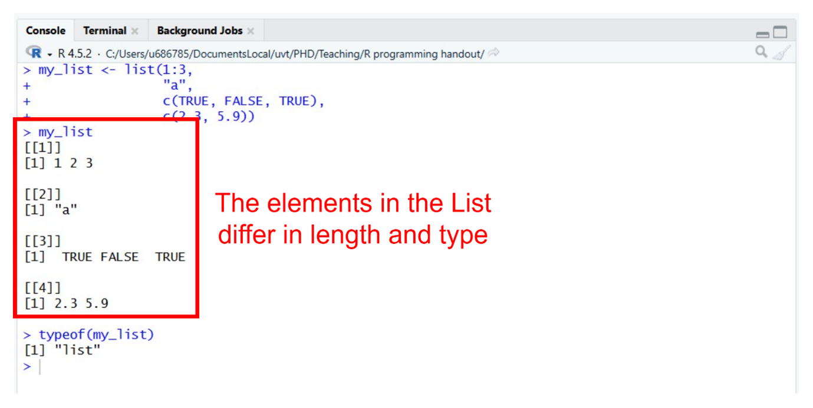
```

#### Data frames

[Data frames]{.underline}are a special type of list consisting entirely of named vectors, where every element within the list must be of the same length. Additionally, because it is made up of vectors, every element within each of these vectors must be of the same type.

Data frames are similar to the datasets you are used to with rows and columns. A data frame is constructed using the `data.frame()` function. Data frames are created similarly to lists. Usually when we construct a data frame, we name the vectors we add as elements in the following way:

```{r}
StarWars <- data.frame(name = c("Luke", "C-3PO", "R2-D2", "Darth Vader", "Leia"), 
                       height = c(172, 167, 96, 202, 150))

StarWars
```

The vectors added as elements into the data frame form the columns of the data frame. The rows are the values for each column at a particular horizontal index

```{r echo = FALSE}
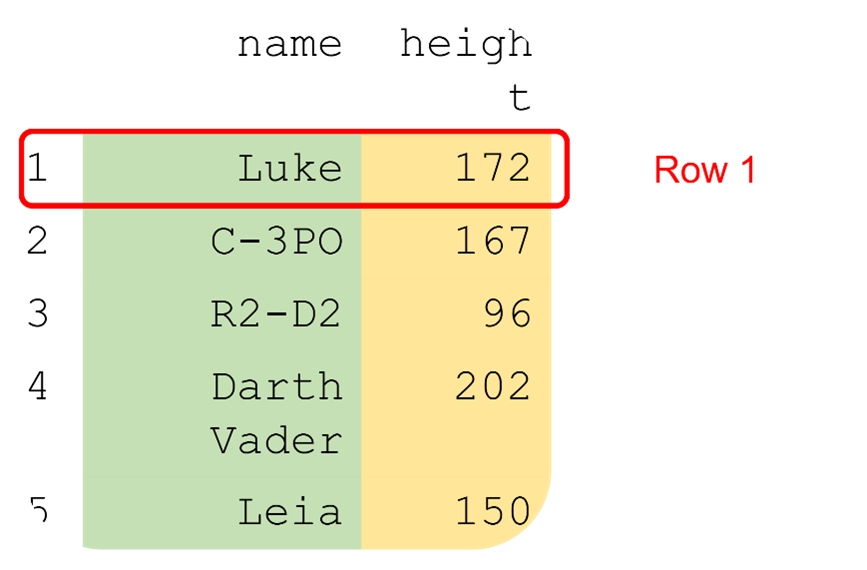
```

```{r echo = FALSE}
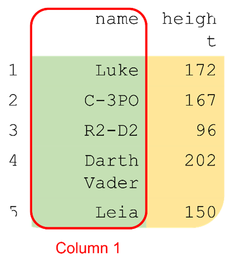
```

You can index a data frame in the same as a matrix:

`my_data_frame[row_nr, col_nr]`

```{r}
StarWars[2, 1]
```

```{r echo = FALSE}
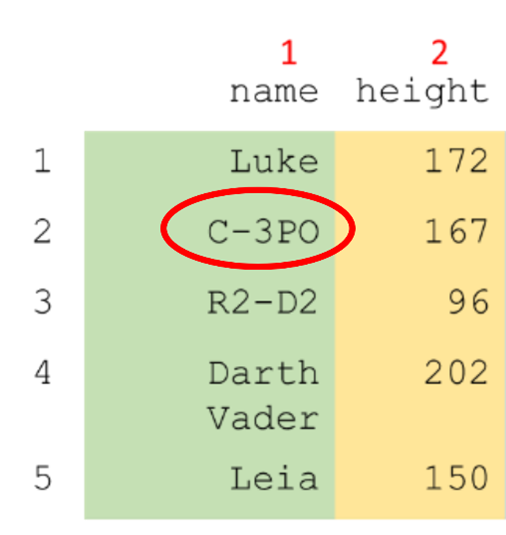
```

You can also index columns using the `$` sign, like: `my_data_frame$variable`

```{r}
StarWars$height
```

```{r echo = FALSE}
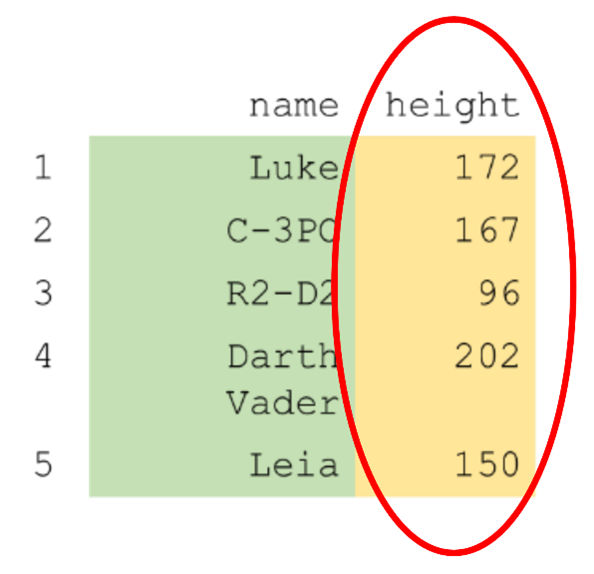
```

You can also use the `$` *add* columns.

```{r}
StarWars$evil <- c(FALSE, FALSE, FALSE, TRUE, FALSE)

StarWars
```

There are thus multiple ways to index the same element from a data frame. Each of the following returns the `"Leia"` from the above data frame.

```{r df-indexing, tidy = FALSE, echo = FALSE}
df <- data.frame(Indexing = c("StarWars[5, 1]", "StarWars[5, \"name\"]", "StarWars$name[5]"),
                 What = c("We index the element in the 5th row from the 1st column.", "We index the element in the 5th row from the \"name\" column.", "We index the \"name\" column, and from that we index the 5th element."))

knitr::kable(df, caption = "Indexing a Data Frame",  booktabs = TRUE)
```

```{r echo = FALSE}
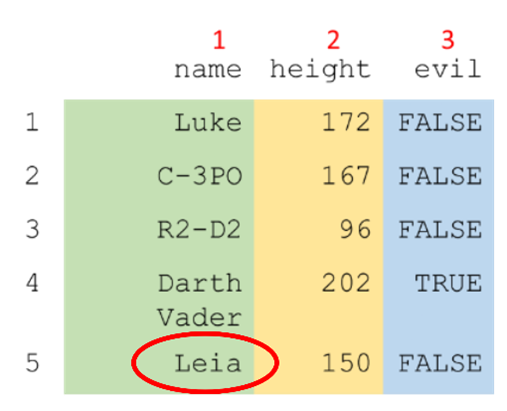
```

#### Combining Elements in a List

You can combine [all]{.underline} types of objects in a list. Every element within an object must be of the same type, but besides that all sorts of objects can be put into a list: scalars, vectors, matrices, data frames, yes even lists can go into lists (and then you can even put lists in those lists). For example:

```{r}
SWList <- list(series = "Star Wars",
               movie_order = c(4, 5, 6, 1, 2, 3, 7, 8, 9),
               leads = data.frame(name = c("Luke", "C-3PO", "R2-D2", "Darth Vader", 
"Leia"),
               height = c(172, 167, 96, 202, 150),
               evil = c(FALSE, FALSE, FALSE, TRUE, FALSE)))

SWList
```

```{r echo = FALSE}
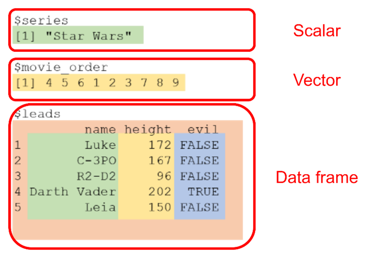
```

In practice, lists are often used to structure a function’s output. In other words, if you run a statistical analysis, you will get different types of output, each stored in a different item of a list.

If you do not name my objects, R will give them numbers in double square brackets.

```{r}
list("Star Wars",
     c(4, 5, 6, 1, 2, 3, 7, 8, 9),
     data.frame(name = c("Luke", "C-3PO", "R2-D2", "Darth Vader", "Leia"),
                height = c(172, 167, 96, 202, 150),
                evil = c(FALSE, FALSE, FALSE, TRUE, FALSE)))
```

Just like with data frames you can use the `$` to index a list if the objects in it are named.

```{r}
SWList$movie_order
```

By using a `$` to index from a list, you are taking the object in the list you want to index out of the list and returning it as its own element unto the console. In the example above that means that we are returning to the console the vector `movie_order` and its contents.

If you index using square brackets `[...]`, you will actually return a list containing only the element you indexed. Thus:

```{r}
SWList[2]
```

Returns a list containing only one object, the movie_order vector. We will demonstrate the importance of this difference when we look at [nested indexing]{.underline} in a list.

Because lists can contain elements containing other elements (which in turn can contain more elements, etc.), it is at times necessary to index an element from within a list, and then to index again within the element you have just indexed. To make this more understandable, let us return to our example and attempt to index the movie order of the 3^rd^ movie:

First, we index the `movie_order` variable from the list, as shown above:

```{r}
SWList$movie_order

# OR

SWList[[2]]
```

Then we add another set of `[...]` after this first indexing to index within this vector:

```{r}
SWList$movie_order[3]

# OR

SWList[[2]][3]
```

```{r echo = FALSE}
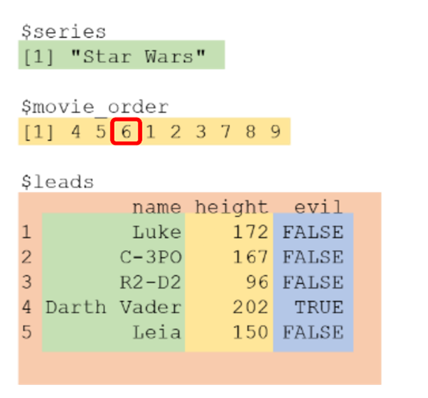
```

You can also do nested indexing of a data frame inside of a list in the following ways:

```{r}
SWList$leads[2, 3]

# OR

SWList[[3]][2, 3]
```

```{r echo = FALSE}
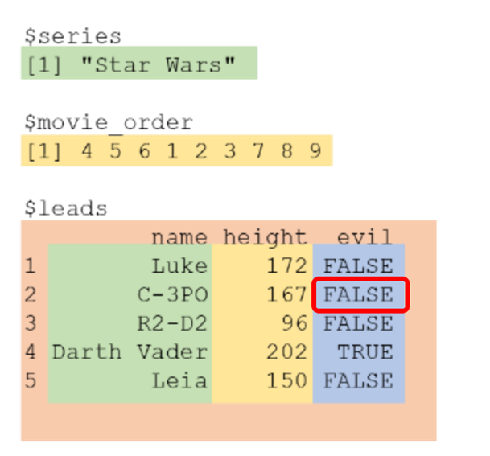
```

However, note here that if we indexed our `movie_order` vector using only single square brackets like so:

`SWList[2]`

We could not index from the vector, as we have only created a new list containing one element and we are now indexing a third element in that list, which it does not have. Therefore, R returns an empty list:

```{r}
SWList[2][3]
```


**START EXERCISE 2.1**

## Reading & Writing Data

So far, we have created all the data that we have used ourselves from scratch in R. Usually, when we are analysing data in research, we make use of datasets from an external source. For example, a .csv file exported from Qualtrics containing all the responses of your participants. We will now look at how we can load in data from external sources into R, and then save them to another file.

#### Build-in datasets

First, there are datasets available in R. These can be accessed just like any other object. For example, the `sleep` dataset can be accessed by just typing `sleep`:

```{r}
sleep
```

We can index this dataset like any other data frame:

```{r}
sleep$group
```

If you want to know more about the contents of the dataset, you can type `?sleep` just you would for a function.

```{r}
?sleep
```

If you want to work with this dataset further, it is advisable to store it as a separate object. This avoids similar issues as demonstrated with `pi` in module 1.

`sleep_data <- sleep`

#### R Packages & Package Datasets

Sometimes R packages also come with their own built-in datasets. These are loaded in the same way as the built-in R datasets. To access these datasets you do need to have the respective package installed and activated.

R packages are extensions to Rs functionality created by members of the R community. Most of the R packages you will work with are hosted on the Comprehensive R Archive Network ([CRAN]{.underline}). Packages hosted on this archive can be installed using the following format of code:

`install.packages("package_name")` You will only need to install your package onto your system once.

However, each time you start an R session, you will need to activate the package using the following code:

`library(package_name)`

```{r eval = FALSE}
install.packages("dplyr") #only run this once

library(dplyr) #run this everytime you start an R session
```

It is generally advisable to run your `install.packages()` functions in the console and not store them in your script.

It is good coding standards to put ALL your library functions at the top of your R script.

Sometimes you will get the following pop-up when installing a package:

```{r echo = FALSE}
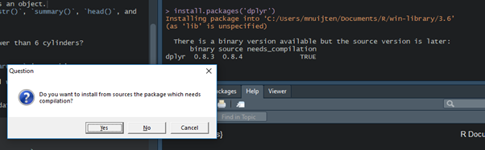
```

This means that there has been a recent update that is not available for your operating system yet. You have two options:

- "Yes": build the latest version from source binary. Takes longer, you need extra packages, but you’ll have the latest version.

- "No": build the previous version from binary files. A lot faster, no extra packages needed, but you won’t have the latest version (often not a problem).

#### Loading Data Files

You can also load in external files containing data into R. These will often be files exported from survey software like Qualtrics, or found through a data archive on the internet. Files that look like the following:

```{r echo = FALSE}
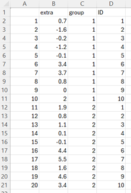
```

You can load these types of files in using dedicated R functions. The function you need depend on the file type.

```{r data-load-types, tidy = FALSE, echo = FALSE}
df <- data.frame(Function = c("read.table()", "read.csv()", "read.csv2()", "load()", "read_spss()", "read_excell()", "import()"),
                 Usage = c("For text files", "For comma separated spread sheets", "For comma separated spread sheets, but different decimal separators (see ?read.csv2)", "For R data files", "For SPSS files, from the package \"foreign\".", "For Excel files, from the package \"readxl\"", "From the package \"rio\". Load any type of data (can be buggy)"),
                 "File Type" = c(".txt", ".csv", ".csv", ".RData", ".sav", ".xlsx", "all"))

knitr::kable(df, caption = "Data Loading Functions",  booktabs = TRUE)
```

To load a file, you simply put the file path to the dataset relative to your working directory as a character string in the function name, as follows:

`read.csv("data/sleep_data.csv")`

To know where you have set your current working directory to, use the following code:

`getwd()`

To set your working directory to the location of your analysis script do:

```{r}
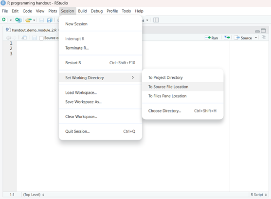
```

[Note]{.underline}: if the first row in the dataset contains the variable names, you will often have to specify the header argument as: `header = TRUE`.

The following functions are generally preferred, because they are stable, platform independent, and the result from these functions will be consistent.

```{r data-load-types-1, tidy = FALSE, echo = FALSE}
df <- data.frame(Function = c("read.table()", "read.csv()", "read.csv2()", "load()"),
                 Usage = c("For text files", "For comma separated spread sheets", "For comma separated spread sheets, but different decimal separators (see ?read.csv2)", "For R data files"),
                 "File Type" = c(".txt", ".csv", ".csv", ".RData"))

knitr::kable(df, caption = "Best Data Loading Functions",  booktabs = TRUE)
```

To save a data set from R to a data file, you can use the following corresponding functions:

```{r data-save-types, tidy = FALSE, echo = FALSE}
df <- data.frame(Function = c("write.table()", "write.csv()", "write.csv2()", "save()"),
                 Usage = c("For text files", "For comma separated spread sheets", "For comma separated spread sheets, but different decimal separators (see ?write.csv2)", "For R data files"),
                 "File Type" = c(".txt", ".csv", ".csv", ".RData"))

knitr::kable(df, caption = "Best Data Loading Functions",  booktabs = TRUE)
```

To save/write a file, you first put the name of the data file object you want to save. Then you put the file path to the directory where you want the store the dataset as a character string in the function, as follows:

`write.csv(sleep_data, "data/sleep_data.csv")`

### Inspecting & Summarizing data

The first step after loading a dataset into your statistical software should always be to check your data, to see if it looks right.

- Are all variables there?

- Are all rows there?

- Are there any weird strings?

- Are there missing values (where I didn’t expect them)?

- Do my variables have the correct names?

- …

#### Summary Functions

There are several ready-made functions that will help you quickly investigate

- `dim() # the dimensions of the data`

- `nrow() # the number of rows in the data frame / matrix`

- `ncol() # the number of columns in the data frame / matrix`

```{r}
dim(sleep)

nrow(sleep)

ncol(sleep)

sleep
```

To evaluate vectors, the following functions are useful:

We have already seen:

- `mean()`

- `median()`

- `sum()`

- `length()`

To find the highest or lowest value in a vector, the following functions can be used:

- `max()`

- `min()`

```{r}
max(c(3, 1, 4, 3))
```

To find the location of the highest or lowest value in a vector, the following functions can be used:

- `which.max()`

- `which.min()`

```{r}
which.max(c(3, 1, 4, 3))
```

The use of other summarizing functions like `View()`, `summary()`, `str()`, `head()`, will be explored in Exercise 2.2.

#### Conditional Selection

So far, when we have indexed datasets or vectors, we have made use of names (e.g.,   `llama_age[‘Zaphod’]`, or `StarWars$height)`, or using numeric values to indicate locations (e.g., `ages[c(1, 3, 4)]`). We can also use vectors of logical (TRUE/FALSE) values for indexing.

To index with a vector of logical values the vector must be the same length as the object you want to index over.

Let’s say for example, we wanted to use logical values to index over the `sleep` dataset, which has 20 rows and 3 columns.

```{r}
dim(sleep)
```

To index the second column of this dataset using logical indexing, we would use:

`c(FALSE, TRUE, FALSE)`

```{r}
sleep[, c(FALSE, TRUE, FALSE)]
```

To index over rows would require a vector of length 20. This would take a lot of work to type out. Fortunately, we can construct logical vectors using [conditional statements]{.underline} as in the following example:

`sleep$extra > 0`

This returns `TRUE` if at that position the value of extra is larger than 0, and `FALSE` otherwise.

```{r}
sleep$extra

sleep$extra > 0
```

To then index with this logical vector, we do the following:

`sleep[sleep$extra > 0, ]`

This means: return all rows in sleep, where the value of the variable extra in the sleep dataset is larger than 0.

```{r}
sleep[sleep$extra > 0, ]
```

You can construct [negative logical expressions]{.underline} by adding the `!` operator in front of the statement. This will turn all “TRUEs” into “FALSEs” and vice versa:

```{r}
sleep$extra > 0

!sleep$extra > 0
```

You can combine logical expressions using the OR ( `|` ), and AND ( `&` ) operators. For example:

`sleep$extra > 0 & sleep$group == 1`

will return true for all cases for which the value of `extra` is larger than 0 and were in `group` 1.

```{r}
sleep$extra > 0 & sleep$group == 1

sleep[sleep$extra > 0 & sleep$group == 1, ]
```

Testing for [missing values]{.underline}works differently. In R missing values are commonly indicated by the special character `NA`. Because this is a special character certain standard operations will not work as expected. For instance:

`sleep$extra == NA`

returns

```{r}
sleep$extra == NA
```

To test for missing values, we instead make use of the `is.na()` function.

```{r}
is.na(sleep$extra)
```

Or for data with NAs:

```{r}
airquality$Ozone

is.na(airquality$Ozone)

airquality$Ozone[!is.na(airquality$Ozone)]
```

Finally, here is a list of the common types of conditional selection operators you will be using:

- `>`            (“greater than")

- `<`            ("smaller than")

- `>=`          ("greater than or equal to")

- `<=`          ("smaller than or equal to")

- `==`          ("equal to")

- `!=`          ("not equal to")

- `is.na()` ("is missing")

- `&`           (“AND”)

- `|`           (“OR”)


**START EXERCISE 2.2**

