# Cleaning & Summarizing Data

Download link for Exercise 3 and the relevant Data: [exercise 3](./exercises/exercise3_files.zip)

Download link for Answers to Exercise 3: [solutions exercise 3](./exercises/exercise3_solutions.R)

## Recoding

In Module 2 we said that you should always check your data as the first step in your analyses. After checking your data, your second step will often be to clean your data. Raw data is often messy and requires you to treat missing values and errors in the data.

In some statistical analysis programs, you as a user specify what is a missing value is. These are often improbable values like 99.

```{r echo = FALSE}
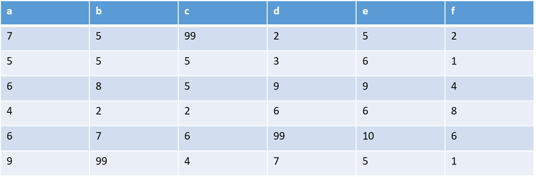
```

R will treat these as numbers (because they are), not as missings. We need to [recode]{.underline} these values to NAs.

```{r}
vector <- c(4, 1, 6, 99, 9)

vector
```

Supposing that the `99` should be a missing value, we recode that specific value into an `NA` by making use of indexing:

```{r}
vector <- c(4, 1, 6, 99, 9)
vector

vector[vector == 99] <- NA
vector
```

## Recoding with Nested Indexing

For data cleaning it is often necessary to make use of complex nested indexing patterns to select the specific elements you want to change.

Let us demonstrate using the following sample data frame:

```{r}
df <- data.frame(var1 = c(4, 1, 6, 99, 9), 
                 var2 = c(99, 9, 1, 4, 2))

df

df == 99

df[df == 99] <- NA

df
```

If we only wanted to change the `99` in the second column, we would do the following:

```{r}
df <- data.frame(var1 = c(4, 1, 6, 99, 9), 
                 var2 = c(99, 9, 1, 4, 2))

df[, 2][df[, 2] == 99] <- NA

df
```

The structure of this nested indexing and data cleaning is as follows:

```{r echo = FALSE}
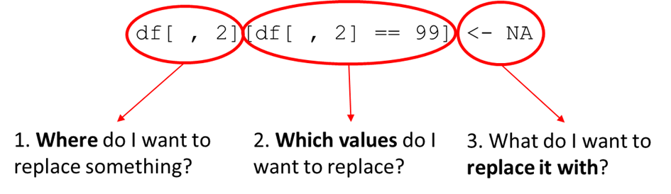
```

```{r echo = FALSE}
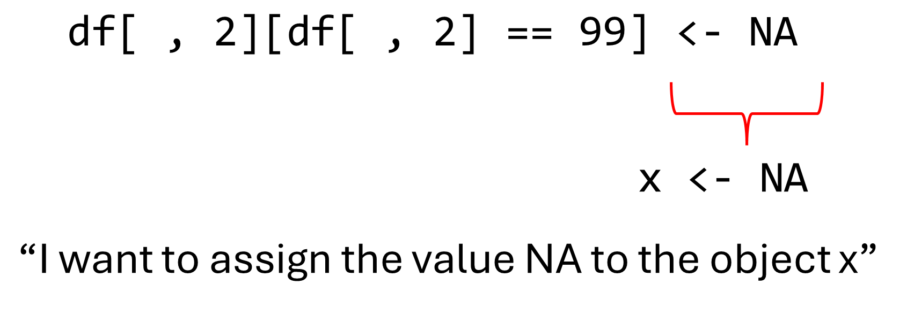
```

```{r echo = FALSE}
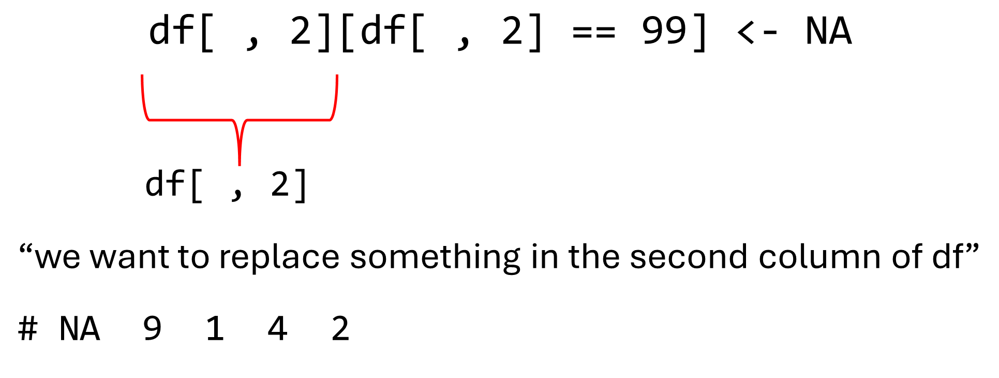
```

```{r echo = FALSE}
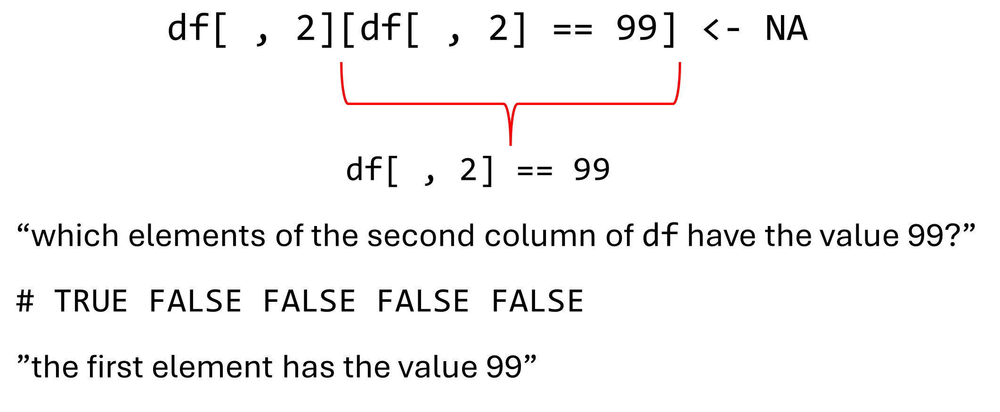
```

```{r echo = FALSE}
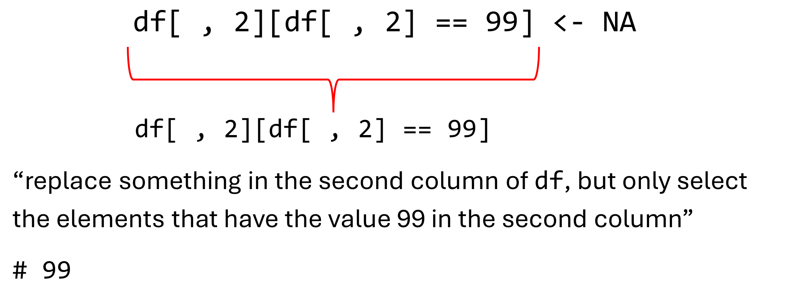
```

```{r echo = FALSE}
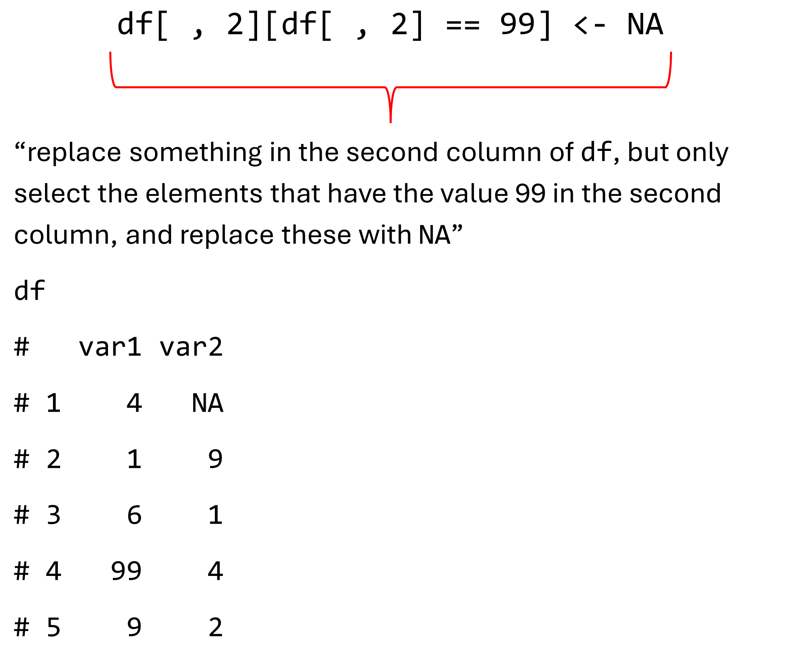
```

If we wanted to do it the other way around, and recode NAs to other values such as 99, the structure of the indexing would remain the same. Thus, we would still follow the following format:

```{r echo = FALSE}
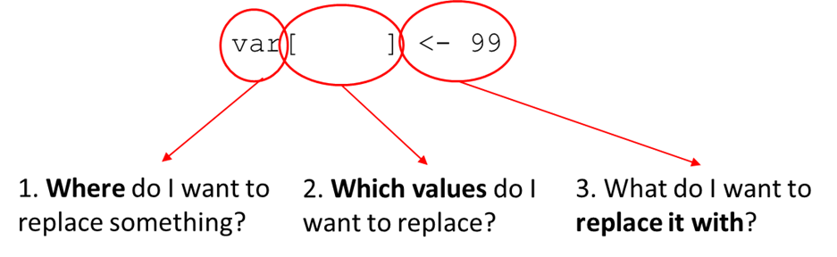
```

Only in this instance we have to make use of the `is.na()` function to detect NAs, because NAs are special characters that work differently:

```{r}
var <- c(4, 1, 6, NA, 9)

var

var[var == NA] <- 99

var
```

As shown in the code above, nothing happens when we use `var == NA`.

```{r}
var == NA
```

We instead need to use the `is.na()` function

```{r}
var

var[is.na(var)] <- 99

var
```

In short:

```{r echo = FALSE}
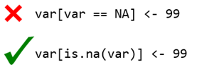
```

**START EXERCISE 3.1**

## Functions in Functions

Remember, all functions take the following form:

```{r echo = FALSE}
knitr::include_graphics("images/FunctionLogicText.png")
```

```{r echo = FALSE}
knitr::include_graphics("images/FunctionExample1.png")
```

We can extend this principle to a sequence of functions where the output of one function becomes the input of another function. As illustrated here with the output of function g becoming the input of function f.

```{r echo = FALSE}
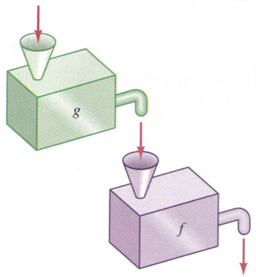
```

We can use this principle to change the following code:

```{r}
df <- mtcars
dfhp <- df $hp
meanhp <- mean(dfhp)
round(meanhp, digits = 1)
```

To this:

```{r}
round(mean(df$hp), digits = 1)
```

## Doing Something to every row/column

One of the advantages of R we have already discussed is that it is a vectorized programming language. Meaning, that in most cases if an operation is performed on a vector it is performed on each element in that vector automatically, without the need for us to code our operation to work specifically on a vector.

Things get a little more complicated if we want to perform actions across every row and column in a data frame or matrix. This is not done automatically in R as for vectors. Luckily there are certain functions we can use that do allow us to perform operations across either rows or columns.

For example, when we want the mean of a vector we use the following operation:

```{r}
vec <- c(6, 7, 3, 10)

mean(vec)
```

If we want the mean of a data frame:

```{r}
grades <- data.frame(course1 = c(6, 4, 8),
                     course2 = c(7, 9, 8),
                     course3 = c(3, 3, 6),
                     course4 = c(10, 10, 9))
```

We can make use of the `colMeans()` function:

```{r}
colSums(grades)
```

We can use similar functions for rows, but first let us name our rows to make the resulting output easier to read.

```{r}
grades

row.names(grades) <- paste0("student", 1:3)

grades
```

The functions we use to get the means and sums for rows are `rowMeans()` and `rowSums()`:

```{r}
rowMeans(grades)

rowSums(grades)
```

Taking means or sums is very common, but you could also be interested in obtaining something else, like the standard deviation for instance.

In that case you can use `apply()`, which is a function than can be used to “apply” any function over either rows or columns.

```{r}
apply(grades, 2, mean)

colMeans(grades)
```

But we can also use other function besides `mean()`.

```{r}
apply(grades, 2, median)

apply(grades, 2, sd)
```

The structure of the `apply()` function is as follows:

```{r echo = FALSE}

```

```{r echo = FALSE}

```

First, we name the object we want to apply a function over. In this case the grades data frame.

```{r echo = FALSE}

```

Second, we specify the margin, meaning whereover we want to apply the function. In this case we specified the second margin which are the columns by choosing 2 as the input. Since there are 1) rows and 2) columns, the second margin is the columns.

The rows are the first margin, so:

```{r}
apply(grades, 1, mean)
```

Is the same as:

```{r}
rowMeans(grades)
```

Third, you specify the function you want to apply. In this case `sd()`, to calculate the standard deviations across all columns in grades. Note that we do not add the brackets `()` when we add the function as an argument in apply (otherwise it would try to enter the output of the function as the argument rather than the function itself as the argument).

```{r echo = FALSE}
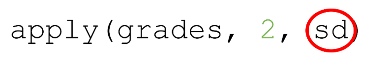
```

#### Applying over Groups

Suppose we had the following data frame with a factor variable,

```{r}
grades2 <- data.frame(course1 = c(6, 4, 8, 6),
                      course2 = c(7, 9, 8, 7),
                      course3 = c(3, 3, 6, 7),
                      course4 = c(10, 10, 9, 2), 
                      gender = factor(c("male", "male", 
                                        "female", "female")))

row.names(grades2) <- paste0("student", 1:4)

grades2
```

and we wanted to know the mean score and standard deviation for `course2` for each `gender` in our data frame.

In that case, we can make use of the `tapply()` function to apply a function for each group separately and return the output for each group.

```{r}
tapply(grades2$course2, grades2$gender, mean)
```

```{r}
tapply(grades2$course2, grades2$gender, sd)
```

```{r echo = FALSE}

```

Similar to `apply()`, we first start with naming the object we want to apply our functions over. This should typically be a vector, so not a data frame unlike in `apply()`.

```{r echo = FALSE}

```

Second, we name the factor variable vector containing the groups across which we want to apply.

```{r echo = FALSE}

```

Third, we just like for apply name the function.

**START EXERCISE 3.2**
