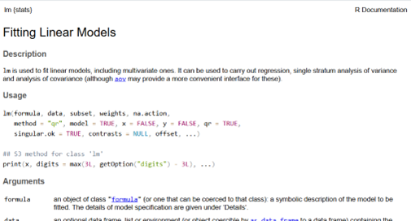
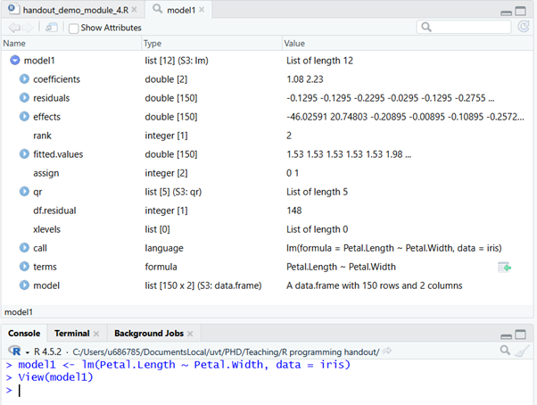

# Statistical Analysis

In this final module, we will look at how we can run some basic statistical functions in R. Fortunately, once the data has been properly loaded, checked, cleaned, and selected, running the statistical analysis is often as simple as running a single function with a handful of arguments.

We will not be discussing the logic behind statistical analyses, or the meaning of these results. That will be the focus of the Multivariate Analysis course.

Download link for Exercise 4 and the relevant Data: [exercise 4](./exercises/exercise4_files.zip)

Download link for Answers to Exercise 4: [solutions exercise 4](./exercises/exercise4_solutions.R)

## Formula Notation

Most statistical functions in R require you to specify your model with formula notation, in the format: `y ~ x`.

```{r echo = FALSE}

```

The analysis function will then take this formula notation and run your model to analyze the relationship between these variables and return the resulting output in a list from which you can then index the relevant results to present (described in more detail later).

If you wanted to add multiple variables, you would do so in the following format:

`y ~ x1 + x2 + x3, etc.`

If you wanted to add an interaction you would do so as follows:

`y ~ x1:x2`

Or equivalently:

`y ~ x1 + x2 + x1*x2`

As an overview, here is a table containing various common ways of specifying different formula notations.

```{r formula-notation, tidy = FALSE, echo = FALSE}
df <- data.frame("Formula in R" = c("y ~ 0 + x /n y ~ x - 1", "y ~ x + z", "y ~x:z", "y ~ x*z", "y ~ poly(x, 2)", "y ~ A", "y ~ A + x", "y ~ A*B*C - A:B:C"),
                 Meaning = c("No intercept", "Main effects", "Interaction", "Main & interaction effects /n Equivalent to: /n y ~ x + z + x:z", "Quadratic (2nd order polynomial)", "ANOVA, A is a factor variable", "ANOVA + covariate", "No 3rd order interaction"))

knitr::kable(df, caption = "Formula Notation in R",  booktabs = TRUE)
```

## Basic Statistical Tests

### Linear Regression

The function used to conduct a linear regression in r is the `lm()` function. Typing `?lm` will show us all the arguments we can specify.

```{r echo = FALSE}

```

There are many potential arguments to specify. Luckily, we can leave most of these functions with the default. We should make sure to specify the following arguments: `formula` & `data`.

As an example, we will use the `iris` dataset, and try to regress petal width on petal length. We can do this as follows:

`lm(Petal.Length ~ Petal.Width, data = iris)`

or

`lm(iris$Petal.Length ~ iris$Petal.Width)`

```{r}
lm(Petal.Length ~ Petal.Width, data = iris)
```

We can see that we successfully ran the regression and we got our estimated coefficients (intercept and association between `Petal.Width` and `Petal.Length`).

However, we did not get any other results such as standard errors, t statistics, p-values, even degrees of freedom are missing.

If we want these additional results, we should first store our results as an object:

```{r}
model1 <- lm(Petal.Length ~ Petal.Width, data = iris)
```

```{r echo = FALSE}

```

Looking at the `model1` object, we can see that it is a list containing the results as well as fitting information for the linear regression model we just ran.

Because these results are a list, we can access additional results from this output by indexing our `model1` object as we have done before:

```{r}
model1$df.residual

model1$residuals
```

Now we know the degrees of freedom for our model. We also have access to the residuals of our model. However, this is still not ideal. A lot of the information in the `model1` object is still several steps away from what we would need to make statistical inferences. Fortunately, there are several ready-made functions to aid our interpretation.

The function you will most often encounter is `summary()`.

```{r}
summary(model1)
```

The summary function returns many useful pieces of information that we would need to draw statistical inferences:

- coefficient estimates, standard errors, t-statistics, and p-values;

- model degrees of freedom, R squared (explained variance), and model fit statistics;

- and more.

### T-tests

For the most part, other statistical tests follow the same structure as our linear regression example: `y ~ x, data = df`

For example, an independent sample t-test to test if the difference in sepal length between “setosa” and “versicolor” plants is significant is ran as follows:

```{r}
iris2 <- iris[iris$Species == "setosa" | iris$Species == "versicolor", ]

model2 <- t.test(Petal.Length ~ Species, data  = iris2)

model2
```

The output from the t-test function itself is informative enough in this case. Besides that, the approach is the same as for `lm()`.

### ANOVA

An ANOVA to test if the differences between “setosa”, “versicolor”, and “virginica” in petal length is significant is performed as follows, using the `aov()` function:

```{r}
model3 <- aov(Petal.Length ~ Species, data = iris)

summary(model3)
```

### Correlations

To calculate the correlation between two variables, we use the `cor()` function, and do so without the model formula and data argument. Instead we simply enter our first variable and then our second variable we wish to check the correlation for:

```{r}
model4 <- cor(iris$Sepal.Length, iris$Sepal.Width)

model4
```

To find out if the correlation is significantly different from 0, we use the `cor.test()` function:

```{r}
model5 <- cor.test(iris$Sepal.Length, iris$Sepal.Width)

model5
```

### Logistic Regression

A logistic regression is like a linear regression, only used to predict a binary variable (Yes/No, employed/unemployed, etc.) instead of a continuous variable (Sepal.Length, conscientiousness, etc.)

To perform a logistic regression, we make use of the `glm()` function. This function is a more general form of the `lm()` function, which can handle outcome variables that are not continuous with normally distributed errors.

However, to use this function properly, we will have to specify an additional argument, the `family` argument.

Without getting into detail about why and how we must change our family specification when we want to conduct a logistic regression. For now, simply know that you should make sure to specify `family =` `binomial()`, when you want to conduct logistic regression using `glm()`.

```{r}
model6 <- glm(Species ~ Sepal.Length, data = iris2, family = binomial())

summary(model6)
```

### Model Comparison

Suppose we have the following two models, and we want to know if adding the `Sepal.Width` variable and the interaction improve the fit of the model.

```{r}
model1 <- lm(Petal.Length ~ Petal.Width, data = iris)

model7 <- lm(Petal.Length ~ Petal.Width*Sepal.Width, data = iris)
```

Note that we cannot merely look at the regression summary output, because we are looking at the change in fit as the result of multiple variables being added to the model.

```{r}
summary(model7)
```

To see which model fits better, we use the (confusingly named) `anova()` function.

```{r}
anova(model1, model7)
```

We can see that based on the p-value (Pr(\>F)), the difference between the two models would be considered statistically significant at an alpha level of 0.05, since the p-value is below 0.05.

### Advanced Statistics

We will not cover advanced statistical models in detail in these modules. We leave it for you to figure out how these more advanced models work. Fortunately, many will follow the same structure as the models we have discussed so far.

For example, suppose we wanted to run a mixed-effects (or multi-level, or hierarchical) regression model, we could use the `lmer()` function from the `lme4` package.

Random intercept model:

`lmer(y ~ x + (1 | id), data = …)`

```{r}
library(lme4)

model8 <- lmer(Reaction ~ Days + (1 | Subject), data = sleepstudy)

summary(model8)
```

**START EXERCISE 4**
